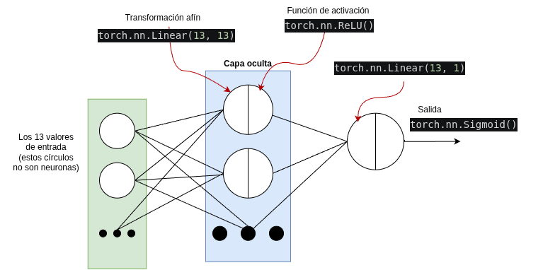

Preguntas correspondientes al cuaderno: _Manipulación de Datos en PyTorch II_

---

TODO:

- Sobre generators y `yield()` en Python
- ¿Por qué queremos usar la clase `Datasets` de PyTorch?
- Sobre `Dataset` y `DataLoader`
- ¿Cuál es la diferencia entre `Dataset` y `DataLoader`? ¿Por qué no simplemente
    usamos `dataset[idx]` para obtener datos?

- `torch.clamp()`

- ¿Qué 3 métodos tiene que tener implementado `Dataset`, y por qué?

- ¿Para qué sirve `Optimiezer.zero_grad()`?

- ¿Para qué sirve `Optimizer.step()`?

---


# Preguntas más complejas

O más complejas, o bien que se me han ocurrido y no tienen mucha relación con
los apuntes (sino con experimentos o situaciones varias en las que me he visto).

::: {.callout-note icon="false" appearance="simple"}

¿Por qué este fragmento de código falla?:

```python
model_1 = torch.nn.Sequential(
	torch.nn.Linear(13, 13),
	torch.nn.ReLU(13, 13),
	torch.nn.Linear(13, 1),
	torch.nn.Sigmoid(1, 1)
)
```

¿Y por qué este otro no?:

```python
model_1 = torch.nn.Sequential(
	torch.nn.Linear(13, 13),
	torch.nn.ReLU(),
	torch.nn.Linear(13, 1),
	torch.nn.Sigmoid()
)
```

::: {.callout-tip collapse="true" title="Solución"}
Si consultamos la documentación vemos:

`class torch.nn.Linear(in_features, out_features, bias=True, device=None, dtype=None)`

que la clase `Linear` necesita, como se está usando bien, mínimo 2 argumentos
`in_features` y `out_features` (ambos enteros, no sé qué tiene de malo poner los
tipos que a nadie les gusta mencionarlos).

Pero `ReLU()` y `Sigmoid()` recibirían si acaso un argumento
`class torch.nn.ReLU(inplace=False)` que no tiene que ver con el número de valores
de entrada y de salida.

**Y es que la función de activación tiene la misma dimensionalidad de entrada y salida**,
no hace falta especificar nada.
:::

:::

---


::: {.callout-note icon="false" appearance="simple"}

¿Cuántas capas ocultas tiene este modelo?

```python {code-line-numbers="true"}
model_1 = torch.nn.Sequential(
	torch.nn.Linear(13, 13),
	torch.nn.ReLU(),
	torch.nn.Linear(13, 1),
	torch.nn.Sigmoid()
)
```

::: {.callout-tip collapse="true" title="Solución"}
Tiene una única capa oculta. Y es que dos líneas de código: `...Linear` y 
`...ReLu` (líneas 2 y 3) hacen una capa: la parte de la transformación afín y la función de 
activación. 



:::

:::