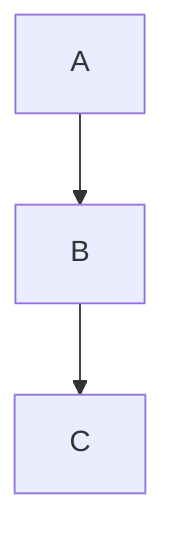

Dejo esto en sucio para acordarme de usarlo luego:

(Me ha gustado y lo usaré para algo).

# Programación para la Inteligencia Artificial
Este es un repositorio de apuntes para la asignatura homónima de Ingeniería Informática, de la Universidad de Málaga.

Se basa en los apuntes originales (García-González, J. (2025). Programación para la Inteligencia Artificial. Universidad de Málaga), y por tanto no es necesariamente autocontenido. Es más bien una especie de extensión: aclaro o profundizo en lo que me haya generado dudas en algún momento o me parezca por cualquier motivo que quiero desarrollar más.

## Cuestiones a responder
Un aspecto muy importante para mí en estos apuntes es intentar sacar preguntas que
hay que saber responder. Puedes usarlas para reflexionar e intentar responderlas.
Es una forma de estudiar que he encontrado bastante eficiente personalmente.
Las preguntas son tanto teóricas como de código. 

Formato web: https://javi-m.github.io/Programacion-para-la-Inteligencia-Artificial/

Las pregunta las gestiono con Quarto (archivos `.qmnd`) para escribirlas en 
Markdown y luego reenderizarlo. Algunas tienen solución, y otras no. 
Si alguien quisiera colaborar daría más detalles de cómo hacer preguntas y 
reenderizar en Quarto.

(`cd Preguntas/` y ejecutar `quarto render`, o desde la raíz del repositorio:
`quarto render Preguntas`)

> Quarto es muy quisquilloso con su sintaxis markdown.

# Sobre el código
Estos apuntes no incluyen soluciones a prácticas. Primero para evitarme problemas a mí y
al estudiante que se copie (por el mero hecho de copiar). Pero es que además hay
que saber en profundidad qué hace cada parte del código, y es uno mismo el que
debe probar.

# Contenidos
- [Diccionario](GLOSSARY.md) Terminología clave.

<!--# **Advertencia**: no me hago responsable
Aunque aquí está mi mejor intento de apuntes que aporten para la asignatura, puede
que contenga errores. Allá aquel que crea de fé ciega lo que pongo, aunque haya
hecho mi mejor intento. O bien cada vez que digo "_esto es importante_...", 
"_esto no es importante_...".
-->

## Uso de IA
Se han utilizado varios LLMs. La gran parte de la redacción es propia, mencionando
los fragmentos que haya copiado por una IA. He leído y revisado todo texto que
hay en este repositorio. No he llevado un registro estricto del uso de _qué modelo
he usado para qué cosa_.

1. LLMs utilizados (modelos gratuitos, a julio de 2026):
    - ChatGPT (más frecuente)
    - Gemini (de vez en cuando)
    - Copilot (en menor medida)
2. Usos principales:
    - Para pedir referencias.
        - Ejemplo: "Dame documentación PyTorch que explique X".
        - Ejemplo: "Busca artículos que expliquen el uso del momentum".
    - Sobre cómo citar ciertas referencias.
    - Cómo generar referencias `.bib`.
    - Para aclaraciones de teoría.
3. Sobre la redacción y edición:
    - Excepto el texto mencionado explícitamente como que es de un LLM, todo ha sido
    redactado y revisado por mí (Javier Márquez Ruiz). 

No ha sido usado para generar preguntas.

No ha sido usado para generar **directamente** respuestas, aunque sí para ciertas 
aclaraciones, a partir de las cuales luego yo he escrito la respuesta. Todo ha
sido revisado, reescrito, y comprobado con otras referencias.