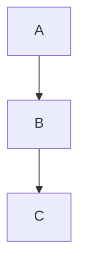

Dejo esto en sucio para acordarme de usarlo luego:

(Me ha gustado y lo usaré para algo).

# Programación para la Inteligencia Artificial
Este es un repositorio de apuntes para la asignatura homónima de Ingeniería Informática,
de la Universidad de Málaga.

Se basa en los apuntes originales[^1] y por tanto no es necesariamente autocontenido. Es más bien una especie de extensión: aclaro o profundizo en lo que me haya generado dudas en algún momento o me parezca por cualquier motivo que quiero desarrollar más.

## Cuestiones a responder
Un aspecto muy importante para mí en estos apuntes es intentar sacar preguntas que
hay que saber responder. Puedes usarlas para reflexionar e intentar responderlas.
Es una forma de estudiar que he encontrado bastante eficiente personalmente.
Las preguntas son tanto teóricas como de código.

Las pregunta las gestiono con Quarto (archivos `.qmnd`) para escribirlas en 
Markdown y luego reenderizarlo. Algunas tienen solución, y otras no. 
Si alguien quisiera colaborar daría más detalles de cómo hacer preguntas y 
reenderizar en cuarto. 

# Sobre el código
Estos apuntes no incluyen soluciones. Primero para evitarme problemas a mí y
al estudiante que se copie (por el mero hecho de copiar). Pero es que además hay
que saber en profundidad qué hace cada parte del código, y es uno mismo el que
debe probar.

# Contenidos
- [Diccionario](GLOSSARY.md) Terminología clave.

<!-- TODO # **Advertencia**: Sobre la fiabilidad de este repositorio / No me responsabilizo -->

# Referencias
[^1]: García-González, J. (2025). Programación para la Inteligencia
Artificial. Universidad de Málaga.